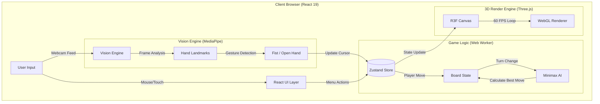

<!-- SECTION 1: HERO -->
<div align="center">
  <!-- Dynamic Header: Matches project theme (Dark Void + Gold) -->
  

  <!-- Logo Placeholder (If you have a logo.svg, uncomment the line below) -->
  <!--  -->

  <br />

  <!-- Animated Typing SVG: Highlighting Key Tech & Features -->
  <a href="https://github.com/Amkhodaei83/connect4-3d-hand">
    
  </a>

  <br />

  <!-- Badges: High-Contrast, SEO-Optimized -->
  <!-- Tech Stack -->
  
  
  
  
  

  <br />
  <br />

  <!-- Action Buttons -->
  <a href="https://Amkhodaei83.github.io/connect4-3d-hand/">
    
  </a>
  <a href="#-getting-started">
    
  </a>
</div>

---

<!-- SECTION 2: TABLE OF CONTENTS -->
## 📚 Table of Contents
<details>
<summary><strong>Expand to view full navigation</strong></summary>

- [🔮 About The Project](#-about-the-project)
  - [The Problem & Solution](#the-problem--solution)
  - [Key Features](#-key-features)
  - [Tech Stack](#-tech-stack)
- [💻 Demo & Architecture](#-demo--architecture)
- [🚀 Getting Started](#-getting-started)
- [🎮 Usage Guide](#-usage-guide)
- [🧠 The AI Engine](#-the-ai-engine)
- [🤝 Contributing](#-contributing)
- [📜 License](#-license)
- [👨‍💻 Author](#-author)

</details>

---

<!-- SECTION 3: ABOUT THE PROJECT -->
## 🔮 About The Project

**Mystic Connect** is not just a game; it is an experiment in **Human-Computer Interaction (HCI)** and **Game AI**. Developed originally for an *Artificial Intelligence* curriculum, this project reimagines the classic Connect-4 board game as an immersive, fantasy-themed 3D experience running entirely in the browser.

Unlike traditional web games that rely on mouse clicks, Mystic Connect introduces a **"Fire Caster" mode**—a gesture-based control system powered by **Google MediaPipe**. Players use their physical hands to "charge" spells (make a fist) and "cast" pieces (open hand) onto the board, bridging the gap between physical movement and digital strategy.

### The Problem & Solution
| The Challenge | The Mystic Solution |
| :--- | :--- |
| **Boring 2D Interfaces:** Most web board games are flat, static grids. | **Immersive WebGL:** A fully 3D floating island environment with dynamic lighting, bloom effects, and physics-based particle systems using **React Three Fiber**. |
| **Predictable AI:** Basic opponents use random moves or shallow lookahead. | **Minimax with Pruning:** A custom-built AI engine using **Minimax Algorithm** with **Alpha-Beta Pruning** (Depth 6), offering a genuine strategic challenge. |
| **Passive Input:** Mouse clicks remove the physical "feel" of playing a piece. | **Computer Vision:** Real-time hand tracking converts webcam input into game actions, making every move feel like casting a magic spell. |

### ✨ Key Features

*   **🧠 Adaptive AI Opponent:** Features 3 distinct difficulty levels (Novice, Adept, Master). The "Master" level looks 6 moves ahead, analyzing thousands of board states per turn.
*   **🖐️ Gesture Control System:** Uses machine learning to detect hand landmarks.
    *   **Fist (✊):** Charge Mana / Grab Cursor.
    *   **Open Hand (🖐):** Cast Spell / Drop Piece.
*   **🎨 High-Fidelity 3D Graphics:** Built with standard web technologies but rendered like a native game using **Three.js**. Includes post-processing (Bloom, Noise, Vignette) for a cinematic feel.
*   **⚡ Zero-Latency State Management:** Powered by **Zustand** for instant updates between the 3D scene, React UI, and Game Logic.

### 🛠 Tech Stack

<div align="center">

| Core | 3D & Graphics | AI & Vision | Styling & Tooling |
| :---: | :---: | :---: | :---: |
|  |  |  |  |
|  |  |  |  |

</div>
<!-- SECTION 4: DEMO & VISUALS -->
## 💻 Demo & Architecture

### Live Experience
<div align="center">
  <a href="https://Amkhodaei83.github.io/connect4-3d-hand/">
    
  </a>
  <p><em>(Works best on Chrome/Edge. Requires webcam permission for Hand Mode.)</em></p>
</div>

### System Architecture
The application runs entirely client-side, orchestrating three major loops simultaneously: the **Render Loop** (3D), the **Vision Loop** (Webcam), and the **Logic Loop** (Game Rules).



---

<!-- SECTION 5: GETTING STARTED -->
## 🚀 Getting Started

Follow these instructions to set up the project locally. You'll need **Node.js 18+** installed.

### Prerequisites
*   **Node.js**: `v18.0.0` or higher.
*   **npm**: `v9.0.0` or higher.
*   **Git**: Latest version recommended.

### Installation

1.  **Clone the Repository**
    ```bash
    git clone https://github.com/Amkhodaei83/connect4-3d-hand.git
    cd connect4-3d-hand
    ```

2.  **Install Dependencies**
    ```bash
    npm install
    ```
    > **Note:** This installs critical libraries like `@mediapipe/hands`, `@react-three/fiber`, and `three`.

3.  **Start Development Server**
    ```bash
    npm run dev
    ```

4.  **Launch in Browser**
    Visit `http://localhost:5173` (or the URL shown in your terminal).

### Environment Variables
This project is client-side only and does not require backend secrets. However, if deploying to a subpath (like GitHub Pages), configure `vite.config.js`:

| Variable | Description | Default |
| :--- | :--- | :--- |
| `base` | Base URL for assets (modify in `vite.config.js`) | `/` |

---

<!-- SECTION 6: USAGE GUIDE -->
## 🎮 Usage Guide

### Mode 1: The Tactician (Mouse Control)
*   **Move:** Hover your mouse over the board columns to aim.
*   **Action:** Click the **Left Mouse Button** to drop a piece.
*   **Best For:** Quick games, testing strategy, or devices without webcams.

### Mode 2: The Fire Caster (Hand Gestures) 🔥
This mode uses your webcam to track your hand position in 3D space.

1.  **Enable Webcam:** Allow browser permission when prompted.
2.  **Aim (Charge Spell):**
    *   Make a **Fist (✊)**.
    *   Hold the fist steady to "grab" the cursor.
    *   Move your hand left or right to move the spell cursor.
3.  **Cast (Drop Piece):**
    *   Open your hand **(🖐)** completely.
    *   Release your fist to drop the piece into the selected column.

> **Pro Tip:** Keep your hand about **0.5 to 1 meter** away from the camera for best tracking accuracy. Good lighting helps the AI see your fingers clearly.

### Difficulty Levels

| Level | Name | Depth | Description |
| :--- | :--- | :--- | :--- |
| **Easy** | *Novice* | Depth 2 | Looks 2 moves ahead. Makes frequent mistakes. Good for learning. |
| **Medium** | *Adept* | Depth 4 | A balanced challenge. Looks 4 moves ahead and blocks obvious threats. |
| **Hard** | *Master* | Depth 6 | **Minimax Power.** Analyzes thousands of outcomes. Prunes aggressively. Very hard to beat. |

<!-- SECTION 7: API REFERENCE -->
## 🧠 The AI Engine

### 1. The Decision Maker (Minimax Algorithm)
The computer opponent uses the **Minimax Algorithm**, a recursive method used in decision-making and game theory.

<details>
<summary><strong>View Algorithm Details</strong></summary>

*   **Zero-Sum Game:** The AI assumes that if a move is good for the player, it is bad for the AI (and vice versa).
*   **Depth-Limited Search:**
    *   *Easy:* Depth 2 (Looks 2 moves ahead).
    *   *Medium:* Depth 4.
    *   *Hard:* Depth 6 (Looks 6 moves ahead).

#### Heuristic Evaluation Function
Because Connect 4 has $4.5 \times 10^{12}$ possible positions, we cannot search the entire tree. The AI stops at a specific depth and calculates a "Score" for the board based on:
*   **Center Column Control:** (+3 points) Pieces in the center are more valuable because they open up more winning lines.
*   **Attack Potential:** (+5 points for 3-in-a-row, +2 for 2-in-a-row).
*   **Defense:** (-4 points) Heavily penalized if the opponent has 3-in-a-row with an empty slot.

#### Optimization (Alpha-Beta Pruning)
To make the AI faster, **Alpha-Beta Pruning** is implemented. This technique stops evaluating a move as soon as it finds a worse possibility than a move already examined. This allows the AI to search twice as deep in the same amount of time.
</details>

### 2. Computer Vision (MediaPipe)
The hand tracking does not rely on simple motion detection. It uses **Google MediaPipe's ML models** to detect 21 3D hand landmarks.

<details>
<summary><strong>View Vision Details</strong></summary>

*   **Gesture State Machine:** We calculate the Euclidean distance between fingertips and the wrist to determine if the hand is "Open" or "Closed."
*   **Smoothing:** Raw webcam data is jittery. The cursor position is interpolated (Linear Interpolation - Lerp) to create a smooth, magical feeling.
</details>

---

<!-- SECTION 8: ROADMAP -->
## 🗺️ Roadmap

- [x] **Core Mechanics**: 3D Board, Pieces, and Rules implemented.
- [x] **Minimax AI**: Depth 2, 4, 6 with Alpha-Beta Pruning.
- [x] **Hand Tracking**: Integration with MediaPipe.
- [x] **Visuals**: Dynamic Lighting, Shadows, Bloom, Noise.
- [ ] **Multiplayer**: WebSocket support for Online PVP.
- [ ] **Mobile Optimization**: Touch controls for mobile browsers.
- [ ] **Sound FX**: Add magical sound effects for piece drops and wins.
- [ ] **Analytics**: Track win/loss ratios against AI difficulty.

---

<!-- SECTION 9: CONTRIBUTING -->
## 🤝 Contributing

Contributions are what make the open source community such an amazing place to learn, inspire, and create. Any contributions you make are **greatly appreciated**.

1.  **Fork the Project**
2.  **Create your Feature Branch** (`git checkout -b feature/AmazingFeature`)
3.  **Commit your Changes** (`git commit -m 'Add some AmazingFeature'`)
4.  **Push to the Branch** (`git push origin feature/AmazingFeature`)
5.  **Open a Pull Request**

---

<!-- SECTION 10: LICENSE -->
## 📜 License

Distributed under the MIT License. See `LICENSE` for more information.

---

<!-- SECTION 11: CONTACT & ACKNOWLEDGMENTS -->
## 👨‍💻 Author & Acknowledgments

**Amirhossein Khodaei**
*   GitHub: [amir-hossein-khodae](https://github.com/amir-hossein-khodae)

**Project created for "Basics of Artificial Intelligence" Lecture - 2026**

*   Special thanks to:
    *   [React Three Fiber Team](https://github.com/pmndrs/react-three-fiber)
    *   [MediaPipe Team](https://google.github.io/mediapipe/)
    *   [Capsule Render](https://capsule-render.vercel.app/) for the header art.


<br />
<div align="center">
  
</div>
