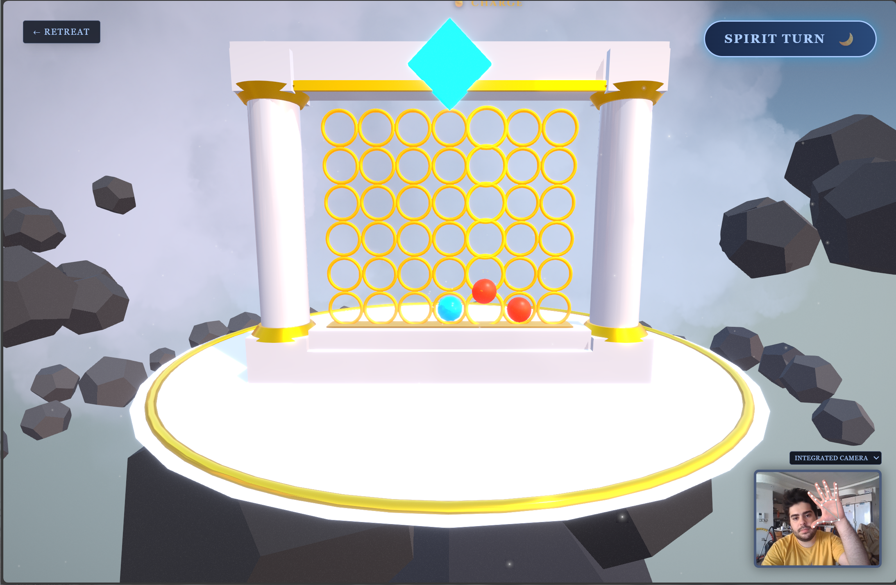

# 🔮 Mystic Connect (3D Hand-Controlled Connect 4)

> **A fantasy-themed 3D Connect 4 game controlled entirely by hand gestures using Computer Vision and AI.**




## 📖 About The Project

This project was developed for the **Basics of Artificial Intelligence** lecture. It reimagines the classic board game *Connect 4* by combining a 3D fantasy environment with modern AI technologies.

Unlike traditional web games, **Mystic Connect** allows players to interact with the board using physical hand gestures captured via webcam. It features a custom-built Minimax AI opponent capable of challenging players at different difficulty levels.

## ✨ Key Features

### 🧠 **The Game AI (Minimax)**
*   **Smart Opponent:** Uses the **Minimax Algorithm** with a depth-limited search.
*   **Alpha-Beta Pruning:** Optimizes decision-making by pruning irrelevant branches of the game tree, allowing for deeper search depths (up to Depth 6 on Hard).
*   **Heuristic Evaluation:** Scores board states based on strategic advantages (center control, 2-in-a-row, 3-in-a-row) rather than just looking for a win.
*   **3 Difficulty Levels:**
    *   *Novice:* Low depth, high randomness.
    *   *Adept:* Medium depth.
    *   *Master:* Full depth with aggressive blocking logic.

### 👁️ **The Vision AI (Computer Vision)**
*   **Hand Tracking:** Powered by Google's **MediaPipe Hands**.
*   **Gesture Recognition:** Custom logic maps hand landmarks to game actions:
    *   ✊ **Fist:** Charge mana and aim the cursor.
    *   🖐 **Open Hand:** Cast the spell (drop the piece).
*   **Real-time Smoothing:** Implements movement interpolation to prevent cursor jitter.

### 🎨 **Immersive 3D Experience**
*   Built with **React Three Fiber (Three.js)**.
*   Features a floating island environment, dynamic lighting, and physically simulated particle effects.
*   Post-processing effects (Bloom, Vignette, Noise) for a magical atmosphere.

## 🛠️ Tech Stack

*   **Frontend Framework:** React 19 (Vite)
*   **3D Engine:** Three.js / @react-three/fiber / @react-three/drei
*   **Computer Vision:** @mediapipe/hands
*   **State Management:** Zustand
*   **Styling:** TailwindCSS
*   **Post-Processing:** @react-three/postprocessing

## 🚀 Getting Started

To run this project locally, you need **Node.js** installed on your machine.

1.  **Clone the repository:**
    ```bash
    git clone https://github.com/Amkhodaei83/connect4-3d-hand.git
    cd connect4-3d-hand
    ```

2.  **Install dependencies:**
    ```bash
    npm install
    ```

3.  **Start the development server:**
    ```bash
    npm run dev
    ```

4.  **Open your browser:**
    Visit `http://localhost:5173` (or the URL shown in your terminal).

> **Note:** For Hand Tracking to work, your browser must have permission to access the webcam.

---

## 🎮 How to Play

### Mode 1: The Tactician (Mouse)
*   **Move:** Hover your mouse over the board to aim.
*   **Action:** Click the Left Mouse Button to drop a piece.

### Mode 2: The Fire Caster (Hand Gestures)
This mode uses your webcam to track your hand position.

1.  **Aim (Charge):** Make a **Fist (✊)**.
    *   Hold the fist steady to "grab" the cursor.
    *   Move your hand left or right to move the spell cursor.
2.  **Drop (Cast):** Open your hand **(🖐)**.
    *   Release your fist to drop the piece into the selected column.

---

## 🧠 Under the Hood: The AI

Since this project was built for an **Artificial Intelligence** course, here is a breakdown of the logic used:

### 1. The Decision Maker (Minimax Algorithm)
The computer opponent uses the **Minimax Algorithm**, a recursive method used in decision-making and game theory.
*   **Zero-Sum Game:** The AI assumes that if a move is good for the player, it is bad for the AI (and vice versa).
*   **Depth-Limited Search:**
    *   *Easy:* Depth 2 (Looks 2 moves ahead).
    *   *Medium:* Depth 4.
    *   *Hard:* Depth 6 (Looks 6 moves ahead).

### 2. Heuristic Evaluation Function
Because Connect 4 has $4.5 \times 10^{12}$ possible positions, we cannot search the entire tree. The AI stops at a specific depth and calculates a "Score" for the board based on:
*   **Center Column Control:** (+3 points) Pieces in the center are more valuable because they open up more winning lines.
*   **Attack Potential:** (+5 points for 3-in-a-row, +2 for 2-in-a-row).
*   **Defense:** (-4 points) Heavily penalized if the opponent has 3-in-a-row with an empty slot.

### 3. Optimization (Alpha-Beta Pruning)
To make the AI faster, **Alpha-Beta Pruning** is implemented. This technique stops evaluating a move as soon as it finds a worse possibility than a move already examined. This allows the AI to search twice as deep in the same amount of time.

### 4. Computer Vision (MediaPipe)
The hand tracking does not rely on simple motion detection. It uses **Google MediaPipe's ML models** to detect 21 3D hand landmarks.
*   **Gesture State Machine:** We calculate the Euclidean distance between fingertips and the wrist to determine if the hand is "Open" or "Closed."
*   **Smoothing:** Raw webcam data is jittery. The cursor position is interpolated (Linear Interpolation - Lerp) to create a smooth, magical feeling.

---

## 📂 Project Structure

```text
connect4-3d-hand/
├── public/mediapipe/      # Local ML models for offline support
├── src/
│   ├── components/
│   │   ├── game/          # Three.js 3D Components (Board, Pieces, World)
│   │   ├── vision/        # Hand Tracking Logic (MediaPipe)
│   │   └── ui/            # React UI Overlays
│   ├── logic/             # Minimax Algorithm & Game Rules
│   ├── store/             # Global State (Zustand)
│   └── App.jsx            # Main Entry Point
└── index.html
```

## 📜 License

Distributed under the MIT License. See `LICENSE` for more information.

## 👨‍💻 Author

**Amirhossein Khodaei**
*   GitHub: [@Amkhodaei83](https://github.com/Amkhodaei83)

---

*Project created for "Basics of Artificial Intelligence" Lecture - 2026*
